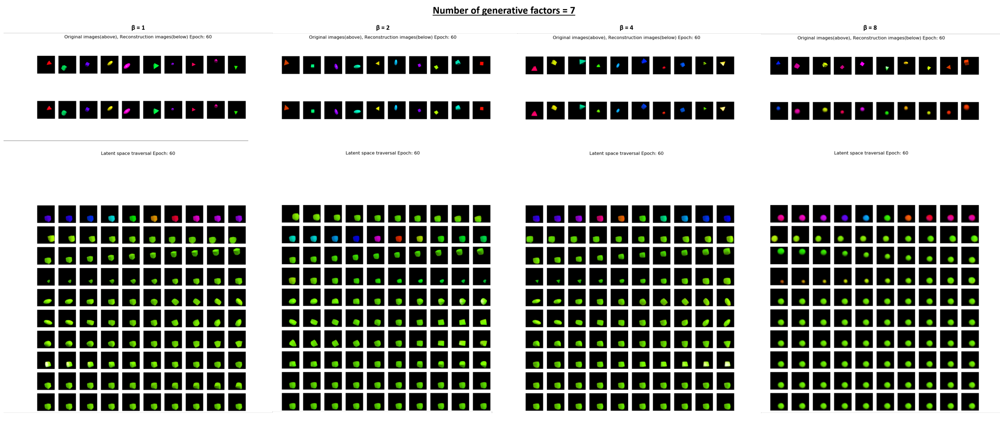
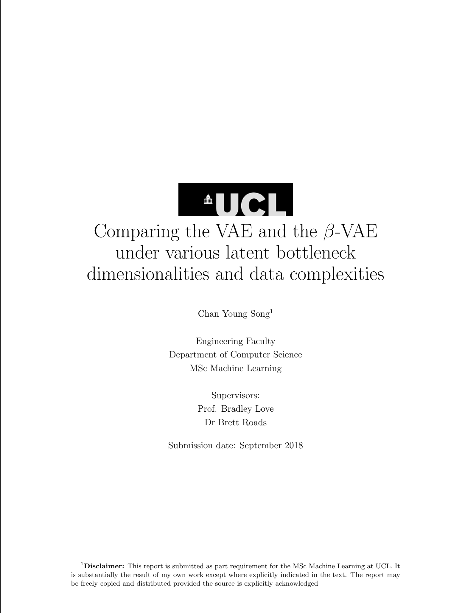

# Comparing the VAE and the β-VAE under various latent bottleneck dimensionalities and data complexities

-   Model is mainly based on the implementation by https://github.com/miyosuda/disentangled_vae
-   `data_generator` contains custom codes which generated the 2d and 3d sprites used for training and testing the β-VAE model.
-   Used to write the UCL MSc Machine Learning dissertation paper ["Comparing the VAE and the Beta-VAE under various latent bottleneck dimensionalities and data complexities"](https://drive.google.com/file/d/1m7UGkXVwrz2D1sS9H-yw8VmQf7-O8N6I/view)
